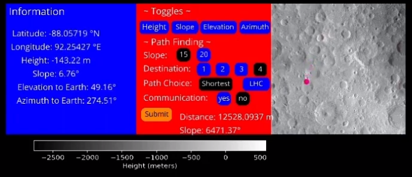

## Generating and displaying lunar terrain

To visualize the lunar surface, we had to create a lunar terrain. We used UV mapping techniques to generate a dynamic terrain. This worked on a small dataset but we ran into issues like long lags in screen refreshes and out of memory errors after using the full data. Through this experiment we learned that the terrain does not need to adjust to rover actions and a pre-generated heightmap using Python will suffice. The terrain using the heightmap looked flat and unrealistic. We did online research and learned that natural looking terrains needed to be smoothed by using noise to generate randomness. We integrated Perlin noise into the heightmap to add a realistic dimension to our lunar terrain.

## Visualizing the App

In the app, users have access to a Control Center located conveniently in the top-left corner. As the user navigates the rover on the lunar surface using arrow keys, the Information box shows the latitude, longitude, height and slope of each point. We also display elevation and azimuth angles from the rover to the earth.To aid in navigation, a minimap accurately illustrates the rover's current location.

## User Toggles

Using the Toggle feature in the app, users can swiftly change the visualization of the lunar surface based on Height, Slope, Azimuth, and Elevation. Each selection is complemented by a color key indicating the scale for clarity and comprehension. This feature is built by leveraging Python Seaborn visualization library and using different colormaps.

For the fail-safe navigation, if our rover seems to be crossing the boundaries of the region, we reposition it to the center.

